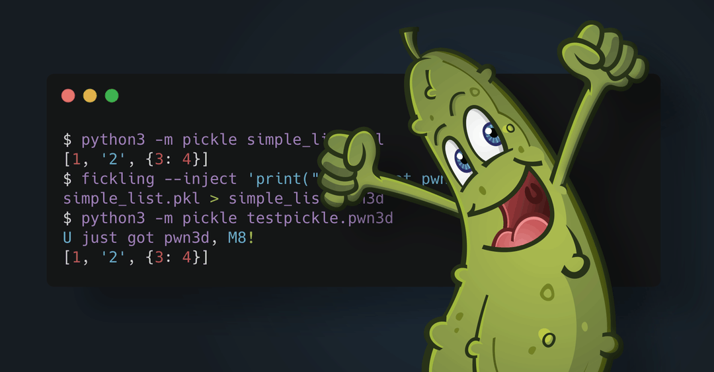

# Fickling



Fickling is a decompiler, static analyzer, and bytecode rewriter for Python
[pickle](https://docs.python.org/3/library/pickle.html) object serializations.
You can use fickling to detect, analyze, reverse engineer, or even create
malicious pickle or pickle-based files, including PyTorch files.

Fickling can be used both as a **python library** and a **CLI**.

* [Installation](#installation)
* [Securing AI/ML environments](#securing-aiml-environments)
* [Generic malicious file detection](#generic-malicious-file-detection)
* [Advanced usage](#advanced-usage)
  * [Trace pickle execution](#trace-pickle-execution)
  * [Pickle code injection](#pickle-code-injection)
  * [Pickle decompilation](#pickle-decompilation)
  * [PyTorch polyglots](#pytorch-polyglots)
* [More information](#more-information)
* [Contact](#contact)

## Installation

Fickling has been tested on Python 3.9 through Python 3.13 and has very few dependencies.
Both the library and command line utility can be installed through pip:

```bash
python -m pip install fickling
```

PyTorch is an optional dependency of Fickling. Therefore, in order to use Fickling's `pytorch`
and `polyglot` modules, you should run:

```bash
python -m pip install fickling[torch]
```

## Securing AI/ML environments

Fickling can help securing AI/ML codebases by automatically scanning pickle files contained in
models. Fickling hooks the pickle module and verifies imports made when loading a model. It only
checks the imports against an allowlist of imports from ML libraries that are considered safe, and blocks files that contain other imports.

To enable Fickling security checks simply run the following lines once in your process, before loading any AI/ML models:

```python
import fickling
# This sets global hooks on pickle
fickling.hook.activate_safe_ml_environment()
```

To remove the protection:

```python
fickling.hook.deactivate_safe_ml_environment()
```

It is possible that the models you are using contain imports that aren't allowed by Fickling. If you still want to load the model, you can simply allow additional imports for your specific use-case with the `also_allow` argument:

```python
fickling.hook.activate_safe_ml_environment(also_allow=[
    "some.import",
    "another.allowed.import",
])
```

**Important**: You should always make sure that manually added imports are actually safe and can not enable attackers to execute arbitrary code. If you are unsure on how to do that, you can open an issue on Fickling's Github repository that indicates the imports/models in question, and our team can review them and include them in the allow list if possible.

## Generic malicious file detection

Fickling can seamlessly be integrated into your codebase to detect and halt the loading of malicious
files at runtime.

Below we show the different ways you can use fickling to enforce safety checks on pickle files.
Under the hood, it hooks the `pickle` library to add safety checks so that loading a pickle file
raises an `UnsafeFileError` exception if malicious content is detected in the file.

#### Option 1 (recommended): check safety of all pickle files loaded

```python
# This enforces safety checks every time pickle.load() is used
fickling.always_check_safety()

# Attempt to load an unsafe file now raises an exception
with open("file.pkl", "rb") as f:
    try:
        pickle.load(f)
    except fickling.UnsafeFileError:
        print("Unsafe file!")
```

#### Option 2: use a context manager

```python
with fickling.check_safety():
    # All pickle files loaded within the context manager are checked for safety
    try:
        with open("file.pkl", "rb") as f:
            pickle.load("file.pkl")
    except fickling.UnsafeFileError:
        print("Unsafe file!")

# Files loaded outside of context manager are NOT checked
pickle.load("file.pkl")
```

#### Option 3: check and load a single file

```python
# Use fickling.load() in place of pickle.load() to check safety and load a single pickle file
try:
    fickling.load("file.pkl")
except fickling.UnsafeFileError as e:
    print("Unsafe file!")
```

#### Option 4: only check pickle file safety without loading

```python3
# Perform a safety check on a pickle file without loading it
if not fickling.is_likely_safe("file.pkl"):
    print("Unsafe file!")
```

#### Accessing the safety analysis results

You can access the details of fickling's safety analysis from within the raised exception:

```python

>>> try:
...     fickling.load("unsafe.pkl")
... except fickling.UnsafeFileError as e:
...     print(e.info)

{
    "severity": "OVERTLY_MALICIOUS",
    "analysis": "Call to `eval(b'[5, 6, 7, 8]')` is almost certainly evidence of a malicious pickle file. Variable `_var0` is assigned value `eval(b'[5, 6, 7, 8]')` but unused afterward; this is suspicious and indicative of a malicious pickle file",
    "detailed_results": {
        "AnalysisResult": {
            "OvertlyBadEval": "eval(b'[5, 6, 7, 8]')",
            "UnusedVariables": [
                "_var0",
                "eval(b'[5, 6, 7, 8]')"
            ]
        }
    }
}
```

If you are using another language than Python, you can still use fickling's `CLI` to
safety-check pickle files:

```console
fickling --check-safety -p pickled.data
```

## Advanced usage

### Trace pickle execution

Fickling's `CLI` allows to safely trace the execution of the Pickle virtual machine without
exercising any malicious code:

```console
fickling --trace file.pkl
```

### Pickle code injection

Fickling allows to inject arbitrary code in a pickle file that will run every time the file is loaded

```console
fickling --inject "print('Malicious')" file.pkl
```

### Pickle decompilation

Fickling can be used to decompile a pickle file for further analysis

```python
>>> import ast, pickle
>>> from fickling.fickle import Pickled
>>> fickled_object = Pickled.load(pickle.dumps([1, 2, 3, 4]))
>>> print(ast.dump(fickled_object.ast, indent=4))
Module(
    body=[
        Assign(
            targets=[
                Name(id='result', ctx=Store())],
            value=List(
                elts=[
                    Constant(value=1),
                    Constant(value=2),
                    Constant(value=3),
                    Constant(value=4)],
                ctx=Load()))],
    type_ignores=[])
```

### PyTorch polyglots

PyTorch contains multiple file formats with which one can make polyglot files, which
are files that can be validly interpreted as more than one file format.
Fickling supports identifying, inspecting, and creating polyglots with the
following PyTorch file formats:

* **PyTorch v0.1.1**: Tar file with sys_info, pickle, storages, and tensors
* **PyTorch v0.1.10**: Stacked pickle files
* **TorchScript v1.0**: ZIP file with model.json
* **TorchScript v1.1**: ZIP file with model.json and attributes.pkl
* **TorchScript v1.3**: ZIP file with data.pkl and constants.pkl
* **TorchScript v1.4**: ZIP file with data.pkl, constants.pkl, and version set at 2 or higher (2 pickle files and a folder)
* **PyTorch v1.3**: ZIP file containing data.pkl (1 pickle file)
* **PyTorch model archive format[ZIP]**: ZIP file that includes Python code files and pickle files

```python
>> import torch
>> import torchvision.models as models
>> from fickling.pytorch import PyTorchModelWrapper
>> model = models.mobilenet_v2()
>> torch.save(model, "mobilenet.pth")
>> fickled_model = PyTorchModelWrapper("mobilenet.pth")
>> print(fickled_model.formats)
Your file is most likely of this format:  PyTorch v1.3
['PyTorch v1.3']
```

Check out [our examples](https://github.com/trailofbits/fickling/tree/master/example)
to learn more about using fickling!

## More information

Pickled Python objects are in fact bytecode that is interpreted by a stack-based
virtual machine built into Python called the "Pickle Machine". Fickling can take
pickled data streams and decompile them into human-readable Python code that,
when executed, will deserialize to the original serialized object. This is made
possible by Fickling’s custom implementation of the PM. Fickling is safe to run
on potentially malicious files because its PM symbolically executes code rather
than overtly executing it.

The authors do not prescribe any meaning to the “F” in Fickling; it could stand
for “fickle,” … or something else. Divining its meaning is a personal journey
in discretion and is left as an exercise to the reader.

Learn more about fickling in our
[blog post](https://blog.trailofbits.com/2021/03/15/never-a-dill-moment-exploiting-machine-learning-pickle-files/)
and [DEF CON AI Village 2021 talk](https://www.youtube.com/watch?v=bZ0m_H_dEJI).

## Contact

If you'd like to file a bug report or feature request, please use our
[issues](https://github.com/trailofbits/fickling/issues) page.
Feel free to contact us or reach out in
[Empire Hacking](https://slack.empirehacking.nyc/) for help using or extending fickling.

## License

This utility was developed by [Trail of Bits](https://www.trailofbits.com/).
It is licensed under the [GNU Lesser General Public License v3.0](LICENSE).
[Contact us](mailto:opensource@trailofbits.com) if you're looking for an
exception to the terms.

© 2021, Trail of Bits.
